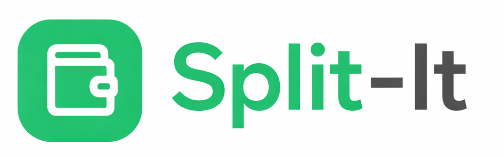

# Split-It - Expense Sharing App 

A modern, full-stack expense sharing application that makes splitting bills with friends easy and organized. Built with React 19, Express.js, MongoDB, and featuring real-time updates with WebSockets.



## ✨ Features

### Core Features
- 👥 **Group Management** - Create and manage expense groups with friends
- 💰 **Smart Expense Tracking** - Add and split expenses with multiple methods (equal, exact amounts, percentages)
- 🍽️ **Itemized Bill Splitting** - Split restaurant bills by individual items
- 📊 **Visual Analytics** - Beautiful charts and graphs to visualize spending patterns
- 💳 **Settlement Optimization** - Smart algorithm to minimize the number of transactions needed
- 🌍 **Multi-Currency Support** - Handle expenses in 150+ currencies with real-time conversion

### Advanced Features
- 📸 **Receipt Scanning (OCR)** - Scan receipts with Tesseract.js to auto-extract expense data
- 🔄 **Recurring Expenses** - Set up automatic recurring expenses (daily, weekly, monthly)
- 📊 **Budget Limits** - Set spending limits per group with alerts
- 🔔 **Push Notifications** - Get notified about new expenses and settlements
- ⚡ **Real-time Updates** - Live updates via WebSockets when group members add expenses
- 📱 **UPI Integration** - Generate UPI payment links for easy settlements (India)

### User Experience
- 🔐 **Secure Authentication** - Email/Password and Google OAuth sign-in
- 🌙 **Dark Mode** - Full dark mode support
- 📱 **Responsive Design** - Works seamlessly on desktop, tablet, and mobile
- 📥 **Export Data** - Download expenses and reports as CSV or PDF
- 🎨 **Modern UI** - Clean interface with shadcn/ui components

## 🛠️ Tech Stack

### Frontend
- **React 19** - Latest React with improved performance
- **React Router v7** - Client-side routing
- **Tailwind CSS** - Utility-first CSS framework
- **shadcn/ui** - High-quality React components
- **Recharts** - Responsive chart library
- **Tesseract.js** - OCR for receipt scanning
- **Socket.io Client** - Real-time communication

### Backend
- **Node.js & Express.js** - RESTful API server
- **MongoDB Atlas** - Cloud database
- **Mongoose** - MongoDB object modeling
- **JWT** - Secure authentication
- **Passport.js** - Google OAuth integration
- **Socket.io** - WebSocket server for real-time updates
- **web-push** - Push notification support
- **node-cron** - Scheduled tasks (recurring expenses, reminders)

## 📋 Prerequisites

- **Node.js** (v16.x or higher) - [Download here](https://nodejs.org/)
- **npm** (comes with Node.js)
- **MongoDB Atlas Account** (free) - [Sign up here](https://www.mongodb.com/cloud/atlas)
- **Google Cloud Account** (for OAuth) - [Console here](https://console.cloud.google.com/)

```bash
node --version  # Should show v16.x or higher
npm --version   # Should show 8.x or higher
```

## 🚀 Quick Start

### 1. Install Dependencies

```bash
# Install frontend dependencies
npm install

# Install backend dependencies
cd server
npm install
cd ..
```

### 2. Configure Environment Variables

**Backend (`server/.env`):**
```env
PORT=5000
NODE_ENV=development
MONGODB_URI=mongodb+srv://<username>:<password>@cluster0.xxxxx.mongodb.net/?retryWrites=true&w=majority
JWT_SECRET=your_super_secret_jwt_key_at_least_32_characters
SERVER_URL=http://localhost:5000
CLIENT_URL=http://localhost:3000
GOOGLE_CLIENT_ID=your_google_client_id.apps.googleusercontent.com
GOOGLE_CLIENT_SECRET=your_google_client_secret

# Push Notifications (generate with: npx web-push generate-vapid-keys)
VAPID_PUBLIC_KEY=your_vapid_public_key
VAPID_PRIVATE_KEY=your_vapid_private_key
VAPID_SUBJECT=mailto:your_email@example.com
```

**Frontend (`.env`):**
```env
REACT_APP_API_URL=http://localhost:5000/api
REACT_APP_GOOGLE_CLIENT_ID=your_google_client_id.apps.googleusercontent.com
```

### 3. Start the Application

```bash
# Start both frontend and backend
npm run dev

# Or run separately:
# Terminal 1 - Backend
cd server && npm start

# Terminal 2 - Frontend
npm start
```

The app will be running at `http://localhost:3000` 🎉

## 📁 Project Structure

```
split-it/
├── public/                     # Static files & PWA assets
│   ├── sw.js                  # Service worker for push notifications
│   └── manifest.json          # PWA manifest
├── src/                       # Frontend source code
│   ├── components/            # React components
│   │   ├── common/           # Reusable components (BillScanner, etc.)
│   │   ├── expense/          # Expense components (ItemizedBillSplit)
│   │   └── ui/               # Base UI components (shadcn/ui)
│   ├── context/              # React Context providers
│   │   ├── AuthContext.jsx   # Authentication state
│   │   ├── GroupContext.jsx  # Group management
│   │   ├── SocketContext.jsx # WebSocket connection
│   │   └── ThemeContext.jsx  # Dark mode
│   ├── pages/                # Page components
│   ├── hooks/                # Custom React hooks
│   ├── lib/                  # Utilities (apiClient, exportCsv)
│   └── utils/                # Helper functions (settlementOptimizer)
├── server/                    # Backend source code
│   ├── controllers/          # Route controllers
│   ├── models/               # Mongoose models
│   ├── routes/               # API routes
│   ├── middleware/           # Express middleware
│   ├── utils/                # Backend utilities
│   │   ├── pushNotifications.js  # Web push
│   │   ├── settlementReminders.js # Scheduled reminders
│   │   └── socketManager.js      # WebSocket handling
│   └── server.js             # Express server
└── package.json
```

## 🗄️ Database Models

| Model | Description |
|-------|-------------|
| **User** | Authentication, profile info, UPI ID, push subscriptions |
| **Group** | Name, members with roles, currency, budget settings |
| **Expense** | Amount, category, split method, payer, itemized splits |
| **Settlement** | Payment between users, status, UPI transaction ref |
| **Notification** | In-app notifications with read status |
| **RecurringExpense** | Template for automatic expense creation |

## 🔑 Key Features Explained

### Split Methods
- **Equal Split** - Divide equally among all members
- **Exact Amounts** - Specify exact amount per person
- **Percentage Split** - Specify percentage per person
- **Split by Items** - Assign specific items to people (restaurant bills)

### Settlement Optimizer
Uses a graph-based algorithm to minimize the number of transactions needed to settle all debts within a group.

### Receipt Scanner
Powered by Tesseract.js OCR to extract:
- Total amount
- Date
- Merchant name
- Individual line items (for itemized splitting)

### Push Notifications
Receive notifications for:
- New expenses added to your groups
- Payments received
- Budget alerts
- Settlement reminders (24-hour overdue)

## 📜 Available Scripts

| Command | Description |
|---------|-------------|
| `npm start` | Start frontend dev server |
| `npm run dev` | Start both frontend & backend |
| `npm run build` | Build for production |
| `npm run server` | Start backend only |

## 🚀 Deployment

### Frontend (Vercel/Netlify)
```bash
npm run build
# Deploy the build/ folder
```

### Backend (Render/Railway)
- Build command: `cd server && npm install`
- Start command: `cd server && npm start`
- Add all environment variables

## 🐛 Troubleshooting

### Port Already in Use
```bash
# Windows
netstat -ano | findstr :3000
taskkill /PID <PID> /F
```

### MongoDB Connection Issues
- Ensure IP is whitelisted in MongoDB Atlas
- Check connection string format
- Verify credentials

### Push Notifications Not Working
- Ensure VAPID keys are configured
- Check browser supports push notifications
- Verify service worker is registered

## 📚 Resources

- [React Documentation](https://react.dev/)
- [Express.js Guide](https://expressjs.com/)
- [MongoDB Documentation](https://docs.mongodb.com/)
- [Tailwind CSS](https://tailwindcss.com/docs)
- [Socket.io](https://socket.io/docs/)

## 📄 License

This project is open source and available under the MIT License.

---

**Made with ❤️ for easy expense sharing with friends**
